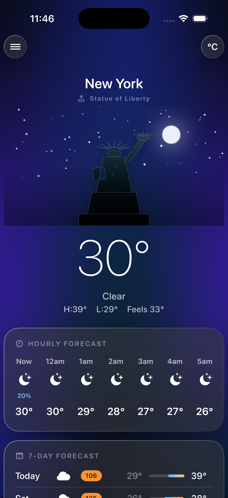

# Welkin

A sleek, futuristic iOS weather app built with SwiftUI. It shows the current
conditions, an hourly forecast for the day, a 7-day outlook with per-day air
quality, and a detailed air-quality breakdown — all over a weather- and
time-of-day-adaptive animated `MeshGradient` background with glassmorphism cards.



## Features

- **Signature landmark scene** ⭐ — every city gets a hand-drawn vector
  silhouette of its icon (Statue of Liberty, Eiffel Tower, Tokyo Tower, Big Ben,
  Golden Gate, Space Needle, Sydney Opera House, Burj Khalifa, Leaning Tower,
  Pyramids, Taj Mahal, Christ the Redeemer — with a procedural skyline fallback).
  The scene is a *living postcard*: the sun/moon is placed by the real
  sunrise/sunset, stars twinkle at night, and rain or snow falls over the skyline
  to match current conditions. Matched by city name or by proximity (≤60 km).
  **47 landmark silhouettes across ~50 cities**, with scroll-driven **parallax**
  for depth. Cities with several icons (New York, Paris, London, Tokyo, …)
  **rotate to a different landmark each day**.
- **Widgets** — Home Screen (small + medium) shows your city's landmark, current
  temperature, condition, high/low, and AQI; Lock Screen (circular, rectangular,
  inline) show a compact glance. All share code with the app and stay in sync via
  an App Group; they refresh ~hourly.
- **Now** — big current temperature, condition, high/low, and "feels like"
- **Hourly** — next 24 hours (temperature, condition, precipitation chance)
- **7-day forecast** — highs/lows on a range bar, condition, a color-coded
  **US AQI** pill per day, plus **rain probability and the exact window**
  ("💧 67% · rain 12pm–5pm"), derived from hourly precipitation
- **Local Flavor** — a daily-rotating local delicacy to try in your city
  (Singapore → Chilli Crab, Tokyo → Ramen, …), curated for ~50 cities
- **Air Quality** — animated AQI gauge, health guidance, and pollutant
  breakdown (PM2.5, PM10, ozone, NO₂)
- **Detail tiles** — UV index, humidity, wind, pressure, feels-like, sunrise/sunset
- **Location** — current location via CoreLocation **and** city search
- **°F / °C** toggle
- Times are always shown in the **location's** timezone

## Data

Powered by the free [Open-Meteo](https://open-meteo.com) APIs — **no API key
required**: forecast, air quality, and geocoding.

## Requirements

- Xcode 26+ / iOS 18+ (uses `MeshGradient` and the `@Observable` macro)
- [XcodeGen](https://github.com/yonaskolb/XcodeGen) — `brew install xcodegen`

## Build & run

```sh
xcodegen generate                       # creates Welkin.xcodeproj from project.yml
open Welkin.xcodeproj                    # then ⌘R in Xcode
```

Or from the command line:

```sh
xcodegen generate
xcodebuild -project Welkin.xcodeproj -scheme Welkin \
  -destination 'platform=iOS Simulator,name=iPhone 17 Pro' build

xcrun simctl install booted build/Build/Products/Debug-iphonesimulator/Welkin.app
xcrun simctl launch booted com.welkin.weather.Welkin
```

To test with a simulated location:

```sh
xcrun simctl location booted set 40.7128,-74.0060   # New York
```

## Architecture

MVVM, no third-party runtime dependencies.

```
Sources/
  Models/         WeatherModels, WeatherCode + SkyMood, AirQuality, Landmark (catalog)
  Services/       WeatherService (Open-Meteo), OpenMeteoDTO, LocationManager
  ViewModels/     WeatherViewModel (@Observable, @MainActor)
  Views/          ContentView, Current/Hourly/Daily/AirQuality/DetailGrid, Search
    Components/    AnimatedBackground (MeshGradient), GlassCard,
                   LandmarkShape (vector silhouettes), LandmarkSceneView,
                   WeatherEffects (Canvas rain/snow/stars)
  DesignSystem/   Theme (typography, spacing, colors)
Resources/        Assets (app icon, accent), Info.plist
```
